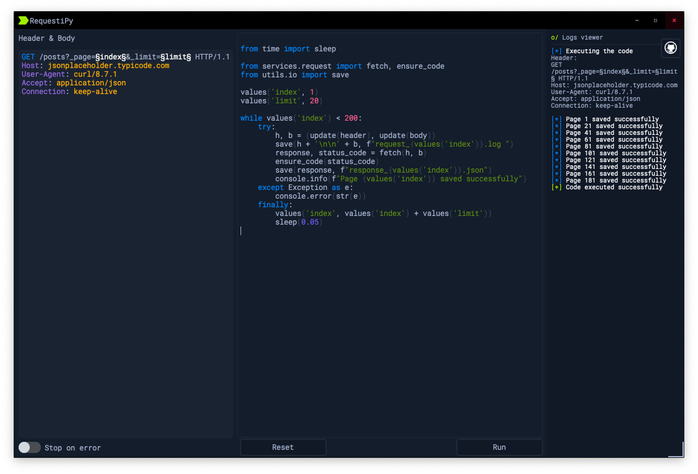

# RequestiPy

<div align='center'>
    
</div>

### A simple scriptable HTTP request tool.

> Note: This project is quite buggy and only designed for my personal use.

#### Requirements:

- pypy3
- make

#### Running:

```bash
make
```
